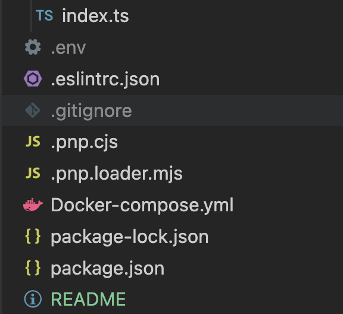
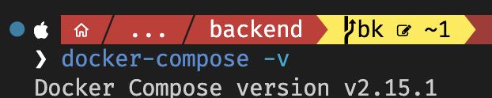
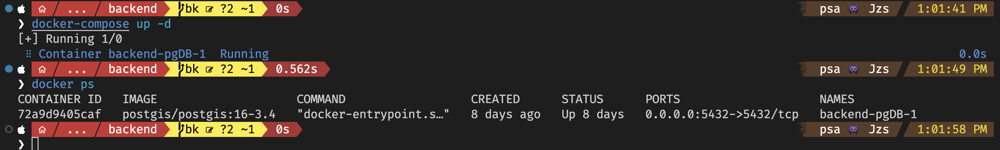
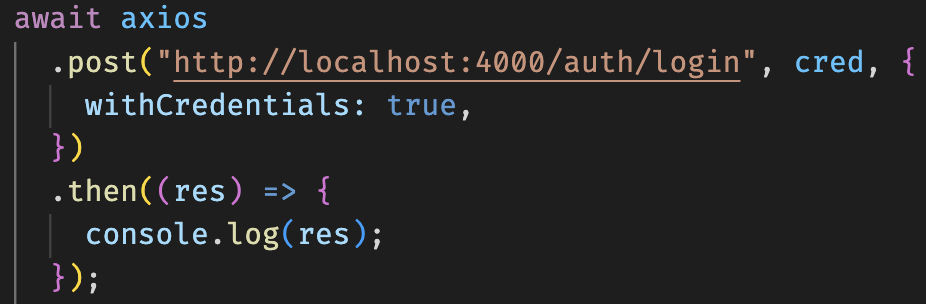

# Backend Project

## Initialization
> To initialize the backend, step-by-step init is required.

- *Install Node Modules (npm install / npm i)*
- *Create .env file inside root folder for storing environment variables for our project*
  - 
  - 5 variables must be declared:
    1. PORT - port number for local development
    2. ENV - node environment ("development" or "production")
    3. DATABASE_URL - postgresql db uri
    4. SESS_SECT - session secrect key
    5. CLIENT_HOST - domain in production
- *Setup PostgreSQL Database*
  - [Docker](https://www.docker.com/products/docker-desktop/) must be installed
  - Check Docker-compose is ready
    - 
    - make sure Docker-compose.yml setup PostgreSQL well
    - run docker-compose file by
      - > docker-compose up -d
      - then check docker container is up by
        - >docker ps
      - 
- *Initialize the database using Prisma* 
  - > npx prisma migrate dev
  - Run seeding for storing pre-records in the database (please check /src/prisma/seeds.ts for records)
    - > npm run seed
- Start Express Server
  - > npm run dev
  - *Both Express & SocketIO server are running..*
  
## Description
+ **Technologies we are using...**
    1. [ExpressJS](https://expressjs.com) (RestAPI)
    2. [SocketIO](https://socket.io) (Real-Time Data Sync)
    3. PostgreSQL (SQL Database)
    4. [Docker](https://www.docker.com) (Containerize Application)
    5. [PassportJS](https://www.passportjs.org) (Authentication)  
       > (Session Authentication method -> ExpressSession + PassportSession)
    6. [Prisma](https://www.prisma.io/docs/getting-started/quickstart) (ORM Express <--> PostgreSQL)
    7. [Multer](https://www.npmjs.com/package/multer) (Storing Images)
    

## Rest API Request

 Return status for each request as follow.
  ```json
  {
    "type": "success" || "error",
    "message": "message",
    "data": "data from DB query" (optional)
  }
  ```
 
  ***!!!NOTE!!!*** 
 >Please be careful about PORT Number.  
 > [Axios](https://axios-http.com/docs/intro) must be used for client side's requests.
 (At the client's side request, config must be added as "***credential:true***", to send client's session cookie to every request if logined)

> Example for Login Request. *(Async Await Function is requred.)*
```javascript
  const cred={
    email: "someemail@g.com",
    password:"somepassword"
  };
```

> 
 

  + Authentication
    1. Login (***POST***) (http://localhost:4000/auth/register)
          + Request Body
              > + **email** : string
              > + **password**: string

    2. Register (***POST***) (http://localhost:4000/auth/login)
         + Request Body
             > + **userType**: "Owner" | "Sitter"
             > + **email**: string
             > + **password**: string
             > + **firstname**: string
             > + **lastname**: string
             > + **street**: string
             > + **city**: string
             > + **province**: string
             > + **postal**: string
             > + **suburb**: string
             > + **lat**: number
             > + **long**: number
          + Users' Address. 
             > + Before making request to register, client must make a request to [LocationIQ](https://locationiq.com) to get the exact location point. Try demo at (https://docs.locationiq.com/docs/autocomplete) \
             Response from LocationIQ as follow for seaching Centennial College
              ```javascript
              [{
                "place_id": "321216337881",
                "osm_id": "33013888",
                "osm_type": "way",
                "licence": "https://locationiq.com/attribution",
                "lat": "43.7857924", // lat
                "lon": "-79.22780958", // long
                "boundingbox": [
                  "43.7831543",
                  "43.7882909",
                  "-79.232005",
                  "-79.2236534"
                ],
                "class": "amenity",
                "type": "college",
                "display_name": "Centennial College, 941, Progress Avenue, Scarborough–Guildwood, Scarborough, Toronto, Golden Horseshoe, Ontario, M1G3T8, Canada",
                "display_place": "Centennial College",
                "display_address": "941, Progress Avenue, Scarborough–Guildwood, Scarborough, Toronto, Golden Horseshoe, Ontario, M1G3T8, Canada",
                "address": {
                  "name": "Centennial College", // street (or)
                  "house_number": "941",
                  "road": "Progress Avenue", // street (or)
                  "neighbourhood": "Scarborough–Guildwood", // suburb (or)
                  "suburb": "Scarborough", // suburb
                  "city": "Toronto", // city
                  "county": "Golden Horseshoe",
                  "state": "Ontario", // province
                  "postcode": "M1G3T8", // postal
                  "country": "Canada",
                  "country_code": "ca"
                }
              }]
              ```
              > based on the response, Client will get the required address data for Login Body and send the request to user.

    3. Logout (***DELETE***) (http://localhost:4000/auth/logout)
        + > Request Body is not required. User must login first
       
             
